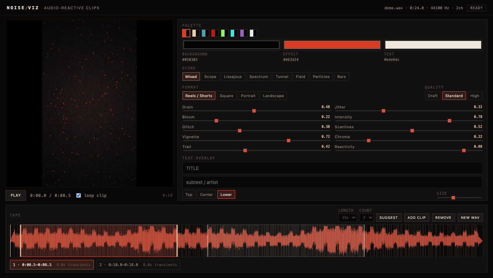
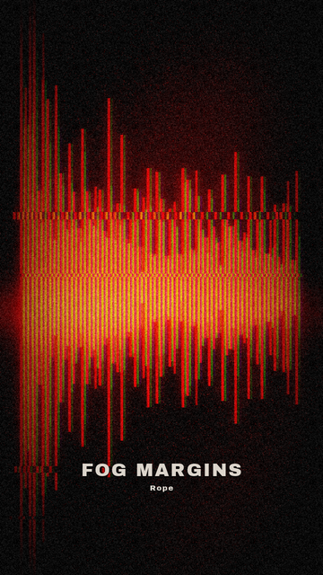

# NOISE/VIZ

WAV → short, audio-reactive visualizer clips. Built for **noise / industrial / drone / experimental** music, dark enough for the genre, with other looks if you want them.

Runs locally in Docker. Nothing is uploaded to a third party.





## What it does

1. Drop a **WAV**.
2. See the waveform, onsets, and **suggested cut points**.
3. Drag, resize, add or remove the bits of the track you want (8–30s, Instagram-friendly).
4. Pick **background, effect and text colors** (or a palette swatch), then ride **grain, jitter, glitch, bloom, scanlines, chroma, trail, reactivity**.
5. Add **title / subtext** on the frame.
6. Live preview in the browser (reacts to the audio).
7. **Render** H.264 + AAC MP4s sized for Reels / Shorts, square, 4:5, or landscape.

Default look is crushed blacks, analog snow, rust and bone. Colors are free: rust, ice, blood, acid, or anything from the pickers.

## Run with Docker

```bash
docker compose up --build
```

Open [http://localhost:8080](http://localhost:8080).

Use **Load demo tape** if you just want to see a look without a file. Uploads and renders persist in the `viz-data` volume.

Or pull the GHCR image (after the first successful Actions run):

```bash
docker run --rm -p 8080:8080 -v noise-viz-data:/data \
  ghcr.io/blodigel/noise-visualizer:latest
```

If the package is private, `docker login ghcr.io` with a GitHub token that has `read:packages`.

## Image on GHCR

Push to `main` (or run the workflow manually). GitHub Actions builds **linux/amd64 + linux/arm64** and pushes:

- `ghcr.io/blodigel/noise-visualizer:latest`
- `ghcr.io/blodigel/noise-visualizer:<sha>`
- `ghcr.io/blodigel/noise-visualizer:main`

After the first push, GitHub may keep the package private. To make it public: **Packages → noise-visualizer → Package settings → Change visibility → Public**.

## Develop without Docker

Needs Python 3.11+, [uv](https://docs.astral.sh/uv/), and **ffmpeg** on `PATH`.

```bash
uv sync --group dev
make dev          # http://localhost:8080
make test
```

## Formats

| Id | Size | Use |
|----|------|-----|
| `reels` | 1080×1920 | Instagram Reels, TikTok, YouTube Shorts |
| `square` | 1080×1080 | Feed |
| `portrait` | 1080×1350 | 4:5 post |
| `landscape` | 1920×1080 | Wide |

Quality: **draft** (half-res, faster), **standard** (1080, CRF 19), **high** (1080, slower, CRF 16). 30 fps, `yuv420p`, `+faststart`, AAC 192k — the combination Instagram actually accepts.

## Clip picking

On upload the app scores sliding windows for energy, dynamics and transients, then greedily picks non-overlapping regions. You can:

- Drag a new region on the tape
- Resize handles
- Double-click to drop a clip of the current length
- **Suggest** again with a different length (8 / 10 / 15 / 20 / 30s) and count (1–6)
- Delete the selected clip (`Backspace`)

Space plays / pauses the selected clip (looped).

## Limits

- WAV (or `.wave`) only, up to 200 MB, 0.5s–30 min
- 1–8 clips per render, each 0.5–90s
- One render job at a time (CPU-heavy)

## License

MIT. See [LICENSE](LICENSE).
